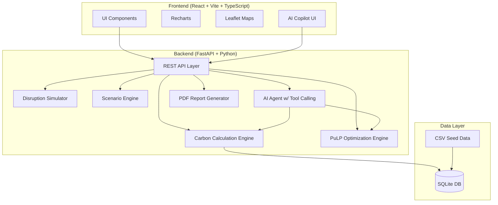

# GreenLane AI — Implementation Plan

> Transform the existing Supply Chain Sustainability Reporting project into a full-stack AI-powered supply-chain control tower.

## Existing Repository Analysis

### What Already Works
| Asset | Status | Reuse Strategy |
|---|---|---|
| `co2_emissions_reporting.py` — core CO₂ formula: `weight_tons × distance × factor` | ✅ Working | Refactor into centralized engine |
| `load_real_data()` — 4-file CSV join pipeline | ✅ Working | Keep as DB seeder |
| `data/order_lines.csv` — 5,208 order lines, Jan–Nov 2021, 558 items | ✅ Clean | Seed into `shipments` table |
| `data/distances.csv` — 19 warehouse→customer routes with Road/Rail/Sea/Air km | ✅ Clean | Seed into `routes` table |
| `data/uom_conversions.csv` — 557 item→kg conversion ratios | ✅ Clean | Seed into `products` table |
| `data/gps_locations.csv` — 19 locations with lat/lng (Europe + Mauritania) | ✅ Clean | Seed into `locations` table |
| Notebook — step-by-step calculation walkthrough | ✅ Reference | Documentation only |

### Critical Issue: Inconsistent Emission Factors
The repository uses **two different sets** of emission factors:

| Mode | `EMISSION_FACTORS` (line 14) | `dict_co2e` (line 188) | Unit |
|---|---|---|---|
| Road | 0.062 | 0.096 | kg CO₂e / tonne·km |
| Rail | 0.022 | 0.028 | kg CO₂e / tonne·km |
| Sea | 0.016 | 0.01 | kg CO₂e / tonne·km |
| Air | 0.602 | 2.1 | kg CO₂e / tonne·km |

> [!IMPORTANT]
> The `dict_co2e` values (line 188) are the ones used on the real dataset and match the `detailed_report.csv` output. The `EMISSION_FACTORS` dict (line 14) is only used in the sample-data fallback path. **I will use `dict_co2e` as the canonical factors** and store both as versioned configurations with source metadata.

### Data Characteristics
- **Geography**: France-based warehouse (Chalons-en-Champagne), customers in France, Germany, UK, Bulgaria, Mauritania
- **Dominant mode**: Road = 99.8% of emissions (4,605 kg), Sea = 0.2% (8 kg), Rail/Air = 0
- **Demo story opportunity**: The existing data is heavily road-dominated. For the demo "aha moment" (10% shipments → 45% emissions), I'll create the **VastraGlobal demo dataset** with air freight outliers alongside the real data.

---

## Architecture



---

## Proposed Changes

### Phase 1 — Project Scaffolding

#### [NEW] `/greenlane-ai/` — Root monorepo
Create the full project structure. The original repo is preserved untouched.

---

### Phase 2 — Backend Carbon Engine

#### [NEW] `backend/app/engines/carbon.py`
Centralized emission calculation. Single canonical function:
```python
def calculate_co2e(weight_kg, distance_km, mode, factor_id=None) -> EmissionResult
```
Returns value + metadata (factor used, source, data quality classification).

#### [NEW] `backend/app/engines/emission_factors.py`
Versioned emission factor registry with source/methodology metadata.

#### [NEW] `backend/app/engines/optimizer.py`
PuLP-based multi-objective optimizer: minimize CO₂ subject to cost/time constraints.

#### [NEW] `backend/app/engines/disruption.py`
Disruption simulator: port closure, supplier failure, route blockage → rerouting.

#### [NEW] `backend/app/engines/scenario.py`
What-if scenario engine: mode switching, load consolidation, carbon pricing.

#### [NEW] `backend/app/engines/forecast.py`
Simple linear/seasonal forecast for next-month/quarter emissions.

---

### Phase 3 — FastAPI Backend

#### [NEW] `backend/app/main.py`
FastAPI application with CORS, routers, DB init.

#### [NEW] `backend/app/api/` — Route modules
- `dashboard.py` — KPI aggregations
- `emissions.py` — Emissions by mode/route/product/geography/time
- `network.py` — Network graph + map data
- `shipments.py` — Shipment CRUD
- `suppliers.py` — Supplier 360
- `scenarios.py` — Scenario CRUD + run
- `optimizer.py` — Optimization endpoint
- `disruptions.py` — Disruption simulation
- `ai.py` — AI chat with tool calling
- `reports.py` — PDF report generation
- `data_quality.py` — Evidence/trust layer
- `esg.py` — ESG readiness

---

### Phase 4 — Database

#### [NEW] `backend/app/models/`
SQLAlchemy models: `Shipment`, `Location`, `Supplier`, `Product`, `Route`, `EmissionFactor`, `Scenario`, `ScenarioResult`, `Disruption`, `Evidence`, `Report`.

#### [NEW] `backend/app/database/seed.py`
Seeds DB from existing CSV files. Maps the 4 CSVs into normalized tables. Creates the VastraGlobal demo dataset.

---

### Phase 5 — AI Copilot

#### [NEW] `backend/app/ai/agent.py`
AI agent with function/tool calling. Tools:
- `get_total_emissions`, `get_top_emitters`, `get_route_emissions`
- `compare_modes`, `run_scenario`, `optimize_plan`
- `get_supplier_metrics`, `simulate_disruption`, `get_data_quality`

In demo mode: uses a local rule-based agent (no external LLM required).

---

### Phase 6 — React Frontend

#### [NEW] `frontend/`
Vite + React + TypeScript + Tailwind CSS.

**Pages** (all functional, no placeholders):
1. `/` — Landing page
2. `/overview` — Control tower dashboard
3. `/network` — Interactive Leaflet map
4. `/emissions` — Tabbed emissions analytics
5. `/scenarios` — What-if simulator
6. `/optimizer` — Optimization with Pareto chart
7. `/copilot` — AI chat interface
8. `/suppliers` — Supplier 360
9. `/risk` — Disruption center
10. `/esg` — ESG & evidence
11. `/reports` — Report generator
12. `/settings` — Emission factors, carbon price config

**Design System**: Dark control-tower theme, green/amber/red semantic colors, Inter font, glassmorphism cards, Framer Motion animations.

---

### Phase 7 — Demo Mode & VastraGlobal Dataset

#### [NEW] Demo dataset
"VastraGlobal Exports" — Indian garment exporter:
- Locations: Bengaluru, Mumbai, Chennai, Delhi, Rotterdam, Hamburg, New York, LA
- Mix of Road/Rail/Sea/Air with air freight causing ~45% of emissions from ~10% of shipments
- Realistic but clearly labeled as demo data

---

## Open Questions

> [!IMPORTANT]
> **LLM API for AI Copilot**: For the hackathon demo, do you want me to:
> 1. **(Recommended)** Build a **rule-based demo AI** that works offline + optional Gemini/OpenAI integration via env var
> 2. Wire it to a specific LLM provider (Gemini, OpenAI, etc.) — requires an API key
>
> The rule-based demo handles the key demo questions ("why are emissions high?", "reduce by 20%") using backend tool results, so the demo works without internet.

> [!IMPORTANT]
> **Currency**: The existing data uses Euros. The demo scenario spec mentions ₹ (INR). Should I:
> 1. **(Recommended)** Keep original data in EUR, demo VastraGlobal data in INR, with configurable currency in settings
> 2. Convert everything to one currency

> [!IMPORTANT]
> **PDF Reports**: Should I use:
> 1. **(Recommended)** HTML-to-PDF via the browser (no heavy Python dependency) — simplest for hackathon
> 2. WeasyPrint/ReportLab (requires system-level dependencies that may be tricky on Windows)

---

## Verification Plan

### Automated Tests
```bash
# Backend
cd backend && python -m pytest tests/ -v

# Frontend
cd frontend && npm test
```

### Manual Verification
1. Start backend: `cd backend && python -m uvicorn app.main:app --reload`
2. Start frontend: `cd frontend && npm run dev`
3. Walk through the 8-step demo flow (landing → dashboard → map → simulate → optimize → AI → disruption → report)
4. Verify all KPIs are computed from backend, not hardcoded
5. Verify emission factor metadata is visible in UI
6. Generate PDF report

### Key Calculation Validation
- Total CO₂ from seeded real data should match original: **4,613.92 kg**
- Emission factors displayed should match `dict_co2e` values
- Scenario mode-switching should produce mathematically correct deltas
